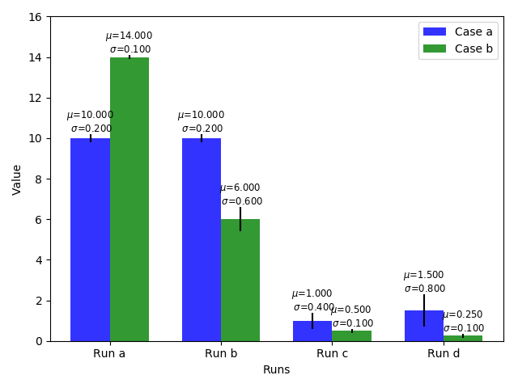
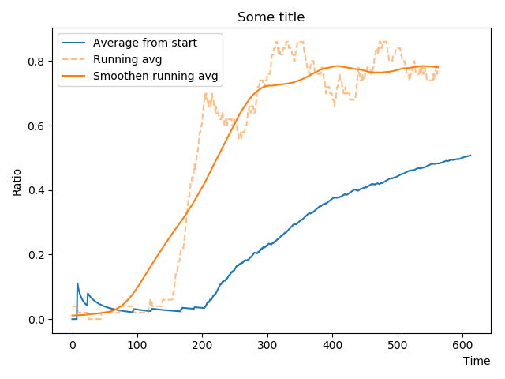
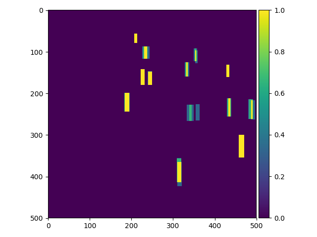

# Visualization utilities

## Requirements
The code is developed and tested using python 3.6 on Mac.
Please install the following python packages from pip or anaconda.
- numpy
- matplotlib
- scipy

## Introduction
The data processing utilities can be found in [`process_data.py`](process_data.py).

## Demos

#### Bar charts
You can generate the following bar chart using the code in [`demo_bar_chart.py`](demo_bar_chart.py).

#### Line charts
You can generate the following line chart using the code in [`demo_line_chart.py`](demo_line_chart.py).

#### Dataset distribution maps (bounding boxes)
You can generate the following dataset distributed map using the code in [`demo_dataset_dist.py`](demo_dataset_dist.py).

